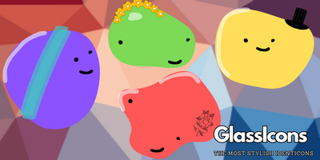

# Glassicon - The Glassy Identicon API

Glassicon is a simple API to generate identicons. It is inspired by [Gravatar](https://en.gravatar.com/) and [Identicon](https://identicon.com)

## Hosting:

- API can be selfhosted, we have a nix file & a setup.sh file to help you get started.
- If you want it easier, you can use our hosted versions at [glassicon](https://glassicon.simonferns.com)
- Donations, contributions & feedback are welcome.

## Tech Stack:

- [Scala](https://www.scala-lang.org/)
- [Akka HTTP](https://doc.akka.io/docs/akka-http/current/index.html)
- [Akka Actors](https://doc.akka.io/docs/akka/current/actors.html)

### Build & Run

```bash
$ nix-shell
# TODO: Include compile step here
```

### Usage

```bash
$ curl https://glassicon.simonferns.com/123
# Outputs an svg file.
```

### Techniques Used

I have found a quite interesting method of building out identicons & assume it is extremely efficient.
There are layers to the identicons, all built up with svg paths.
We also convert your input to a md5 hash, which is split up into 2 character segments for the layers.

- **layer 1** - background path. The 2 character segment is converted to a semi oval shape.
- **layer 2** - background colour. The 2 character segment is converted to a colour to be used.
- **layer 3** - eye & mouth type. The 2 character segment is converted to a '$number.svg' file to be used.
- **layer 3** - eye & mouth colour. The 2 character segment is converted to a colour to be used.
- **layer 4** - eye & mouth position. The 2 character segment is converted to a position to be used. With interpolation to ensure it stays in bounds.
- **layer 5** - eye & mouth rotation. The 2 character segment is converted to a rotation to be used.
- **layer 6** - eye & mouth scale. The 2 character segment is converted to a scale to be used.
- **layer 7** - highlight. The 2 character segment is converted to a colour to be used as the highlight.
- **layer 8** - highlight rotation. The 2 character segment is converted to a rotation for the highlight.
- **layer 9** - highlight scale. The 2 character segment is converted to a scale for the highlight.

_More layers can be added in the future, but this is a good start._

### Examples - Coming Soon

---
